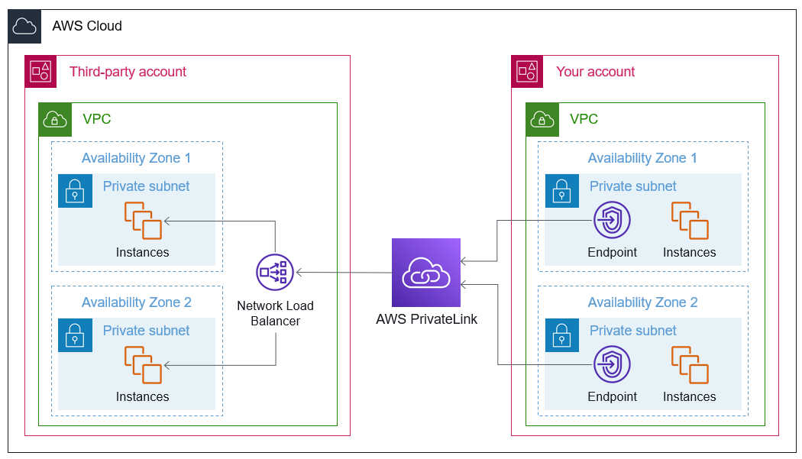
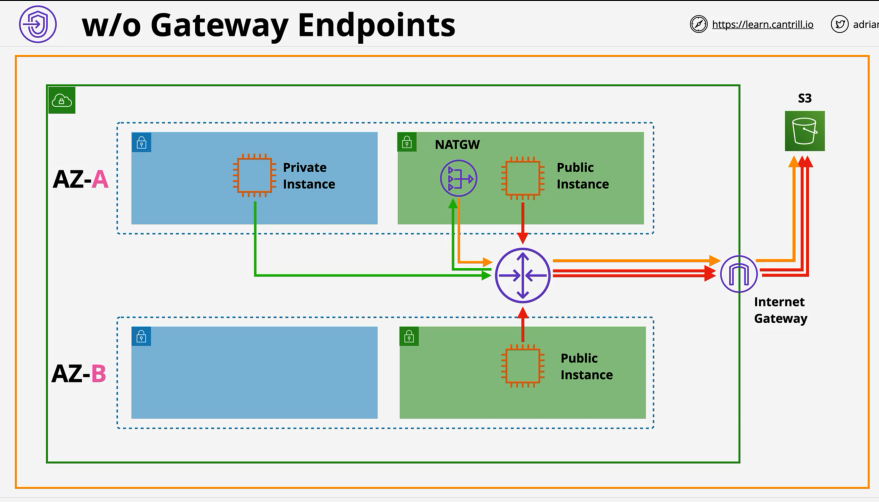
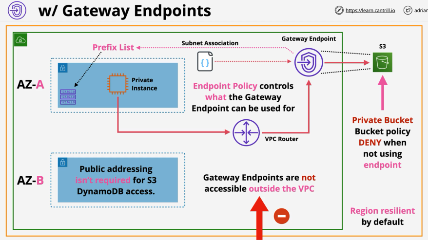
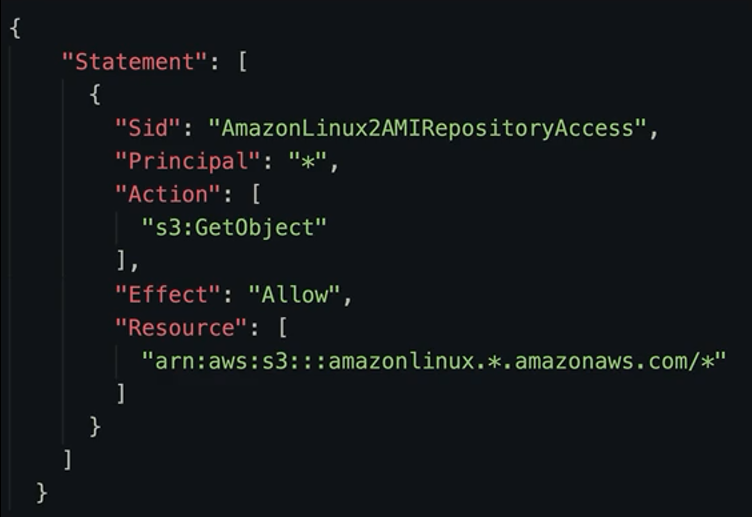
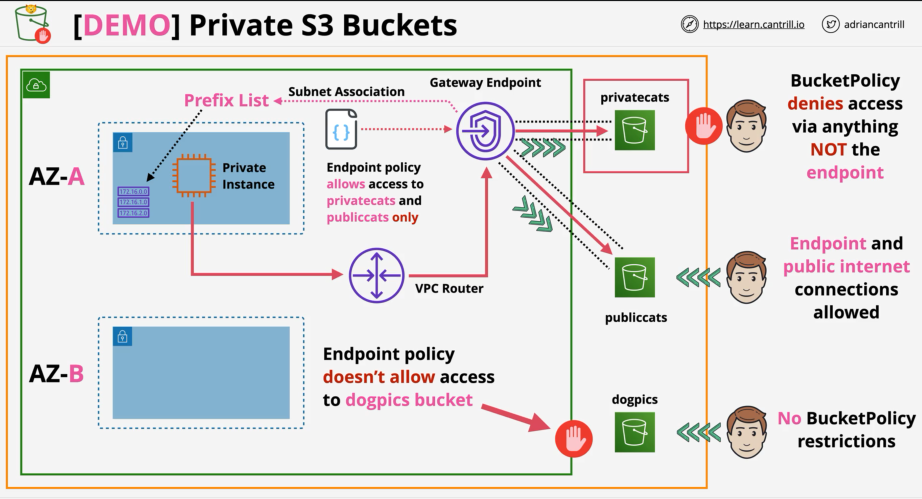

## AWS PrivateLink

- Lets you access services defined in other VPC using private IP
- Traffic never leaves AWS network
- VPC Service Provider: VPC where the consumed services are defined (third-party account here)
  - Services that you want to expose
  - NLB at the front
  - NLB configured as VPC endpoint service
- VPC Service Consumer: VPC where the resources are consumed
  - VPC Interface Endpoint (ENI) in each subnet pointing to the provider's NLB service
- Permissions are granted with SGs and NACLs between endpoint service (NLB) and IAM users/roles/acounts. The consumer's ENIs that have those permissions can then route traffic to the NLB

Facts:

- PrivateLink can be picked as an option when creating an endpoint to integrate with a 3rd-party for example.
- Highly-available only via multiple endpoints
- IPv4 & TCP only (IPv6 NOT supported)
- Private DNS is supported => possible to use the service's public hostname instead of the private IP to reach the provider VPC.
  - Behind the scenes => AWS creates a private hosted zone in R53
  - Record that translates service's public hostname => private ENI IP
  - From within a VPC attached to that private hosted zone => record is resolved with private hosted zone
- Direct Connect, Site-to-Size VPN, and VPC Peering are supported



## VPC Endpoints

### Gateway Endpoints

- Gateway endpoints provide private access to supported services: **S3** and **DynamoDB**
- They allow any resource in a private only VPC to access S3/DynamoDB (public services)
- We create a gateway endpoint per service per region and associate it to one or more subnets in a VPC
- We allocate a gateway endpoint to a subnet, a _Prefix List_ is added to the route table for the subnet. This prefix lists targets the gateway endpoint
- Any traffic targeted to S3/DynamoDB will go through the gateway endpoint and not through the internet gateway
- Gateway endpoints are highly available across all AZs in a region by default. You can select which subnets it should be deployed into, and AWS configures it on your behalf.
- **Endpoint policy**: allows what things can be connected to from the endpoint (example: a particular subset of S3 buckets)
- Gateway endpoints can be used to access services in the **same region only**
- Gateway endpoints allow private only S3 buckets: S3 buckets can be set to private allowing only access from the gateway endpoint. This will help prevent _Leaky Buckets_
- Gateway endpoints are logical gateway objects, they can be only accessed from inside the assigned VPC





### Interface Endpoints

- Interface endpoints provide private access to AWS public services similar to Gateway Endpoints
- Historically => any other service than S3 & DynamoDB => interface, but now, interface endpoint is available for S3
- Difference between gateway endpoints and interface endpoints is that interface endpoints are **not HA by default**. Interface endpoints are added to subnets as an ENI
- In order to have HA, we have to add an interface endpoint to every subnet per AZ inside of a VPC
- Interface endpoints are able to have security groups assigned to them (gateway endpoints do not allow SGs)
- We can also use endpoints policies, similar to gateway endpoints
- Interface endpoints only support TCP or IPv4
- Interface endpoints use **PrivateLink** behind the scenes
- Gateway endpoints use prefix lists, interface endpoints use DNS. Interface endpoints provide a new DNS name for every service they are meant communicate with
- Interface endpoints are given a number of DNS names:
  - Endpoint Regional DNS: works from whatever AZ used to access the endpoint (good for HA) => vpce-<id>.<service>.<region>.vpce.amazonaws.com
  - Endpoint Zonal DNS: resolves to the IP from the AZ of the DNS record => vpce-<id>-<az>.<service>.<region>.vpce.amazonaws.com
  - PrivateDNS: overrides the default service DNS with a new version pointing to interface endpoint (**enabled by default**). AWS creates a private hosted zone in VPC => use s3.amazonaws.com directly instead of the vpce hostname and it will resolve to the private IP.

## Gateway vs Interface Endpoint

Gateway:

- HA by design
- Resource: gateway in route table
- Uses Route Tables, not DNS. The public hostname is routed privately thanks to the route added to the RT
- Only S3 and DynamoDB
- Cross-account not supported

Interface:

- Uses ENIs => not HA by design
- Resource: ENI in a subnet
- Uses DNS names to resolve into private IP
- Cross-account supported via PrivateLink sharing

## VPC Endpoints Policies

- Endpoints policies don't grant access to any AWS services => the underlying identities accessing the resources still need the permissions to access them
- An endpoint policy only limits access if the service is accessed to the specific endpoint
- The endpoint policy contains a policy and conditions (who has access to what)
- Policies are commonly used to limit what private VPCs can access
- By default => giving full access to all actions in all services to the endpoint, and letting all principals in the AWS account use the endpoint:

```
{
  "Statement": [
    {
      "Effect": "Allow",
      "Principal": "*",
      "Action": "*",
      "Resource": "*"
    }
  ]
}
```

- Work like normal IAM policies:
  

## Demo: Restricting Access to S3 Content


