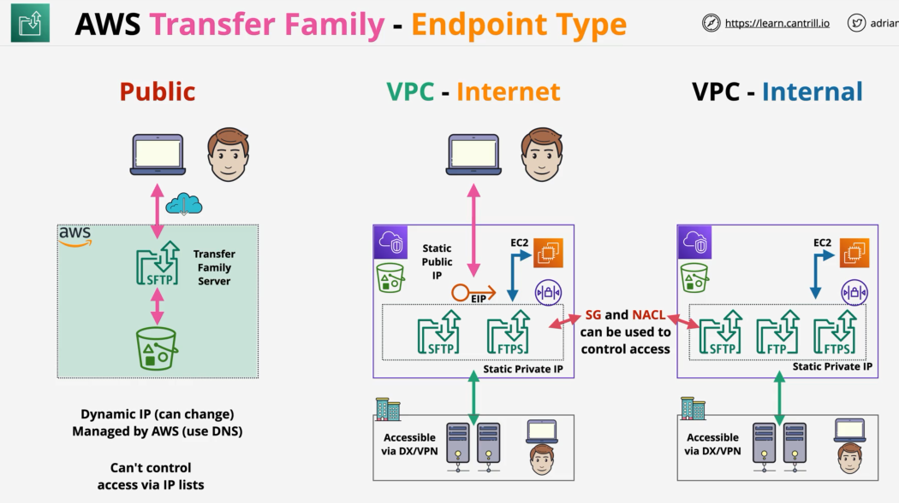

# AWS Transfer Family

- File transfer service TO or FROM **S3** and **EFS**
- Supported protocols:
  - FTP (File Transfer Protocol) - unencrypted
  - FTPS (FTP Secure) - file transfer with TLS encryption
  - SFTP (SSH FTP) - file transfer over SSH
  - AS2 (Applicability Statement 2) - structured B2B data
- Transfer Family supports a wide range of identities: service managed, Directory Service, custom (Lambda/API Gateway)
- Managed File Transfer Workflows (MFTW): serverless file workflow engine:
  - Can be used when file are uploaded, we can define workflows as to what happens to the file as it gets uploaded

## Transfer Family Endpoint Types

- Within Transfer Family we create servers which we can think of as the front-end accesspoint to our storage
- They present S3 and EFS via one or more supported protocol
- How we access these servers depends on how configure the service's endpoints:
  - Public: runs on the AWS public zone, accessible to the public internet
    - No networking components to configure
    - Only supported protocol is SFTP
    - The endpoint has a dynamic IP which can change, we should use DNS to access it
    - We can't control who will access it using features such as NACLs or security groups
  - VPC - Internet Access
    - Runs in a VPC
    - We can use SFTP/FTPS and AS2 protocols
    - Anything that has connectivity to the VPC (DX/VPN) can access it as it was running inside the VPC
    - Transfer Family provides a static IP for it
    - SG/NACLs are supported
    - It is allocated an Elastic IP for it which is static, which allows it to be accessed over the public internet
  - VPC - Internal
    - Runs inside a VPC
    - We can use SFTP/FTPS/FTP and AS2 protocols
    - Anything that has connectivity to the VPC (DX/VPN) can access it as it was running inside the VPC
    - Transfer Family provides a static IP for it
    - SG/NACLs are supported

## Other Features

- It is multi-AZ => resilient and scalable
- Cost is based for provisioned server per hour + data transfer
- With FTP/FTPS only Directory Service and Custom IDP is supported
- FTP can only be used internally within a VPC
- AS2 has to be VPC Internet/Internal only, we cannot use the public endpoint type
- Use cases for Transfer Family:
  - In case we need access to S3/EFS but using the supported protocols
  - Integration with existing workflows
  - Using MFTW to create new workflows
