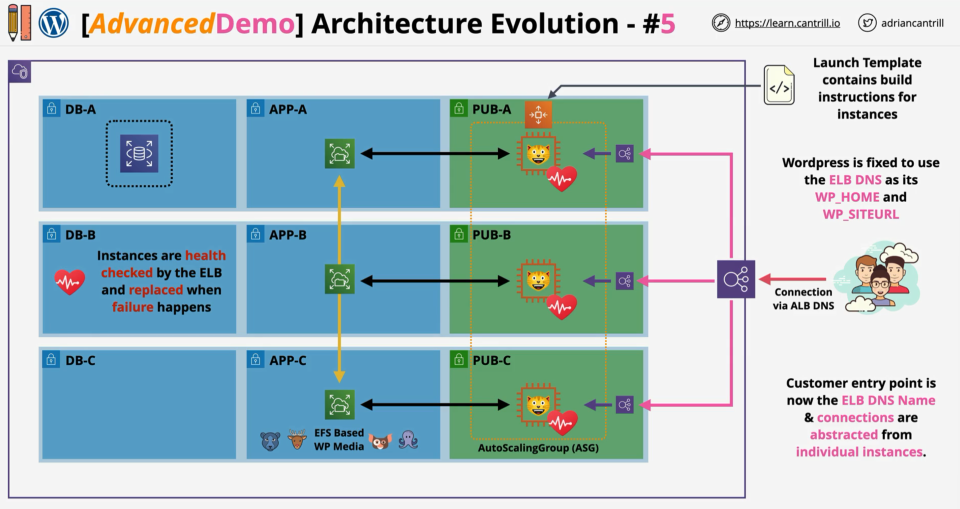

# ELB - Elastic Load Balancer

## ELB Architecture

- It is the job of the load balancer to accept connections from customers and distribute those connections to any registered backend compute
- ELBs support many different types of compute services
- LB architecture:
  
- Initial configurations for ELB:
  - IPv4 or dual stack (IPv4 + IPv6)
  - We have to pick the AZs which the LB will use, specifically we are picking 1x subnet in 2 or more AZs
  - When we pick a subnet, AWS places one or more load balancer nodes in that subnet
  - When an LB is created, it has a DNS A record. This A record points to all the nodes provisioned for the LB => all the incoming connections are distributed equally
  - The nodes are HA: if the node fails, a different one is created. If the load is to high, multiple nodes are created
  - We have to decide on creation if the LB is internal or internet-facing.
- Load Balancers are configured with listeners which accept traffic on a port and protocol and communicate with the targets
- An internat facing load balancer can connect to both public and private instances
- Minimum subnet size for a LB to function is /28 = 8+ free addresses per subnet (AWS suggests a minimum of /27 to allow scaling)
- Internet-facing LB are same as internal LB but they additionally have public IP address assigned to their nodes. BUT nodes are deployed the same way.

## Cross-Zone Load Balancing

- An LB by default has at least one node per AZ that it is configured for
- Historically, each LB node could **ONLY** distribute connections to instances in the same AZ -** Cross-Zone Load Balancing:** allows any LB node to distribute connections equally across all registered instances in all AZs.
- This help with the uneven distribution of load and could be helpful in EXAM
- ALB: always ON.
- NLB: OFF by default, but can be enabled.

## User Session State

- Session state:
  - A piece of server side information specific to one single user of one application
  - It does persist while the user interacts with the application
  - Examples of session state: shopping cart, workflow position, login state
- The data representing a sessions state is either stored internally or externally (stateless applications)
- Externally hosted session:
  - Session data is hosted outside of the back-end instances => application becomes stateless
  - Offers the possibility to do load balancing for the back-end instances, the session wont get lost in case the LB redirects the user to a different instance

## ELB Evolution

- Currently there are 3 different types of LB in AWS
- Load balancers are split between v1 and v2 (always preferred)
- Classic Load Balancer (v1)
  - CLBs can load balance HTTP/HTTPS and lower level protocols as well, although they can not understand the http protocol, they can't make decision based on HTTP protocols features
  - CLBs can have **only 1 SSL certificate** per load balancer
  - They can not be considered entirely a layer 7 product
  - We should default to using v2 load balancer for newer deployments
- Version 2 (v2) load balancers:
  - Application Load Balancer (ALB): layer 7 devices, they support HTTP(S) and WebSocket protocols
  - Network Load Balancer (NLB): supports lower level protocols such as TCP, TLS and UDP. These could be used for applications like Email servers, Games or applications which don't use HTTP/s protocols.
- In general v2 load balancers are faster and they support target groups and rules, this allow to use single LB for multiple things.

## ALB vs NLB

- Consolidation of load balancers:
  - Classic load balancers do not scale, they do not support multiple SSL certificates (no SNI support) => for every application a new load balancer is required
  - V2 load balancers support rules and target groups
  - V2 load balancers can have host based rules using SNI => for ex you could host two websites example1.com and api.example2.com on the same ALB, so hosted on same IP + port. In R53, 2x records pointing to ALB, and then configured on the ALB to route traffic differently based on hostname (Host Rule).
- **Application Load Balancer (ALB)**:

  - ALB is a true layer 7 load balancer, configured to listen to either HTTP or HTTPS protocols
  - ALB can not understand any other layer 7 protocols (such as SMTP, SSH, etc.) and layer 4 (TCP, UDP, TLS)
  - ALB requires HTTP and HTTPS listeners
  - It can understand layer 7 content, such as cookies, custom headers, user location, app behavior, etc.
  - Any incoming connection (HTTP, HTTPS) is always terminated on the ALB - no unbroken SSL - followed by new connection to the app
  - All ALBs using HTTPS must have SSL certificates installed
  - ALBs are slower than NLBs because they require more levels of networking stack to process. Any EXAM question which talks about performance, NLB should be considered instead of ALB.
  - ALBs offer health checks evaluation at application layer.
  - ALB Rules:
    - Rules direct connection which arrive at a listener
    - Rules are processed in a priority order, default rule being a catch all (last one to be processed)
    - Rule conditions: host-header, http-header, http-request-method, path-pattern, query-string and source-ip
    - Rule actions: forward, redirect, fixed-response, authenticate-oidc and authenticate-cognito
  - The connection from the LB and the instance is a separate connection
  - If you need to forward connections without terminating on the LB, then you need to consider NLB. (EXAM)

- **Network Load Balancer (NLB)**:

  - NLBs are layer 4 load balancers, meaning they support TPC, TLS, UDP, TCP_UDP connections
  - They have no understanding of HTTP or HTTPS
  - No headers, no cookies, no session stickiness
  - They are really fast, can handle millions of request per second having 25% latency of ALBs because they don't have to deal with any of the heavy computational upper layers.
  - Recommended for SMTP, SSH, game servers, financial apps (not HTTP(S)) <-- EXAM
  - Health checks can only check ICMP or TCP handshake, **NOT** app aware
  - They can be allocated with static IP addresses which is useful for whitelisting for corporate clients
  - They can forward TCP straight through the instances => unbroken encryption <-- EXAM
  - NLBs can be used for PrivateLink <-- EXAM

- **Scenarios for NLB (otherwise => default to ALB)**:
  - Unbroken encryption
  - Static IP for whitelisting
  - Fast performance
  - Protocols other tha HTTP or HTTPS
  - Privatelink

## Session Stickiness

- Stickiness: allows us to control which backend instance to be used for a given connection
- With no stickiness => connections are distributed across all backend services
- Enabling stickiness:
  - CLB: we can enable it per LB
  - ALB: we can enable it per target group
- When stickiness is enabled, the LB generates a cookie: `AWSALB` for ALB / `AWSELB` for CLB which is delivered to the end-user
- This cookie has a duration defined between 1s and 7 days
- When the user accesses the LB, it provides the cookie to the LB
- The LB can then decide to route the connection to the same backend instance every time while the cookie is not expired
- Change of the backed instance if the cookie is present:
  - If the instance to which the cookie maps to fails, then a new instance will be selected
  - If the cookie expires => the cookie will be removed, new cookie is created while a new instance is chosen
- Session stickiness problems: load can become unbalanced (with heavy users)
- Enable session stickiness if an application does **NOT** use external sessions

## Connection Draining and Deregistration Delay

- **Connection draining (CLB)**
  - Setting which controls what happens when instances are unhealthy or deregistered
  - Default behavior: LB closes all connections and the instance receives no new connections
  - Allows in-flight requests to complete for a certain amount of time, while no new connections are sent to the instance
  - Only supported on **Classic Load Balancers**. It is defined on the load balancer itself
  - Connection draining is a timeout between 1 and 3600 seconds (default 300s)
  - If the instance become unhealthy because if a failed health check, connection draining settings do not apply to it
  - If an instance is taken out of service manually or by an ASG, it is listed "InService: Instance deregistration currently in progress". If we use an ASG, it will wait for all connections to complete before terminating or for the timeout value
- **Deregistration delay (ALB, NLB, GWLB)**
  - Essentially the same feature as connection draining, but it is supported by ALB, NLB and GWLBs
  - It is defined on target groups, not on the LB
  - It works by stopping sending connections to deregistering targets. Existing connections can continue until they complete naturally or the deregistration delay is reached
  - Deregistration delay is enabled by default on all the new LBs, default value: 300s (configurable between 0-3600 seconds)

## `X-Forwarded-For` and PROXY protocol

- In case a client connects to a backend without any load balancing in the front of the backend, the IP address of the client is visible and can be recorded
- With load balancers this can be more complicated, this is where `X-Forwarded-For` header and the PROXY protocol become handy
- `X-Forwarded-For` is a HTTP header, it only works with HTTP/HTTPS. This is a layer 7 header.
  - This header is added/appended by proxies/load balancers. It can have multiple values in case the request is passing multiple proxies/load balancers. E.g `X-Forwarded-For: 1.3.3.7(ClientIP), proxy1, proxy2, ...` => client is the element on the left
  - The backend server needs to be aware of this header and needs to support it
  - Supported on CLB and ALB, NLB does not supports it because they don't support the layer 7 of the OSI stack.
- **PROXY protocol** works at Layer 4, it is an additional layer 4 (tcp) header => works with a wide range or protocols (including HTTP/HTTPS)

  - There are 2 versions of PROXY protocol:
    - v1: human readable, works with CLB
    - v2: binary encoded, works with NLB
      - v2 can support an unbroken HTTPS connection (tcp listener). Use case for this: end to end encryption
  - With unbroken HTTPS => headers are encrypted, only possible to use PROXY protocol

  ## EC2 Advanced Demo

  
