# DynamoDB

- NoSQL, wide column, DB-as-a-Service product
- Public product
- DynamoDB can handle key/value data or document data
- It requires no self-managed servers or infrastructure to be managed
- Supports a range of scaling options:
  - Manual/automatic provisioned performance IN/OUT
  - On-Demand mode
- DynamoDB is highly resilient across AZs and optionally globally
- DynamoDB is really fast, provides single-digit ms data retrieval
- Provides automatic backups, point-in-time recovery and encryption at rest
- Supports event-driven integration, provides actions when data is modified inside a table

## DynamoDB Tables

- A table in DynamoDB is a grouping of items with the same primary key
- Primary key can be a simple primary key (Partition Key - PK) or composite primary key (Partition Key + Sort Key - SK)
- In a table there are **NO** limits to the number of items
- In case of composite keys, the combination of PK and SK should be unique
- Items can have, besides primary key, other data named attributes
- Every item can be different as long as it has the same primary key
- An item can be **at max 400 KB**
- DynamoDB can be configured with provisioned and on-demand capacity (capacity = speed)
- For on-demand capacity, we have to set:
  - Wite-Capacity Units (WCU): 1 WCU = 1KB per second
  - Read-Capacity Units (RCU): 1 RCU = 4KB per second

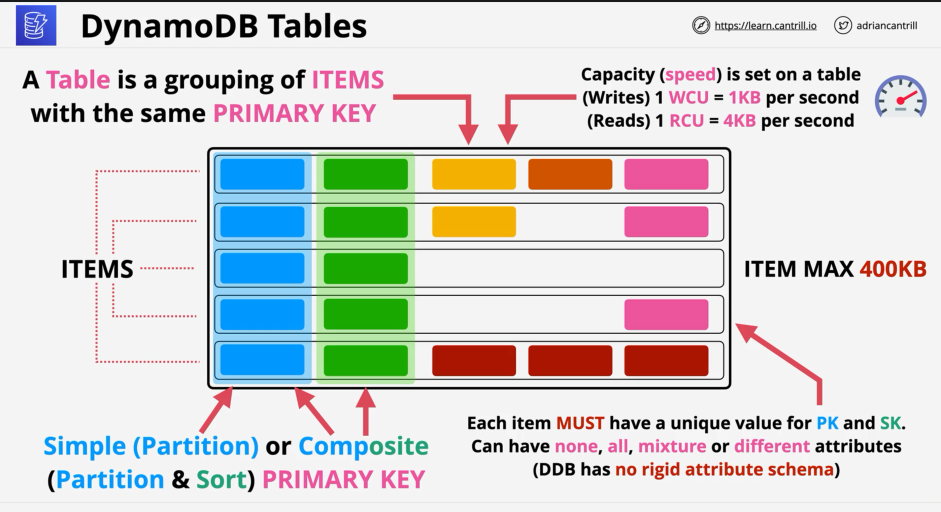

## DynamoDB Backups

- On-demand backups:
  - Full copy of the table is retained until the backup is removed
  - Can be used to restore data and config in same region or cross-region
  - We can retain or remove the indexes
  - Similarly, we can adjust encryption settings
- Point-in-time Recovery:
  - **Not enabled by default**, has to be enabled
  - It is a continuous record of changes
  - Allows replay to any point in the window (35 days recovery window)
  - From this 35 day window we can restore to a new DB table with a **1 second granularity**

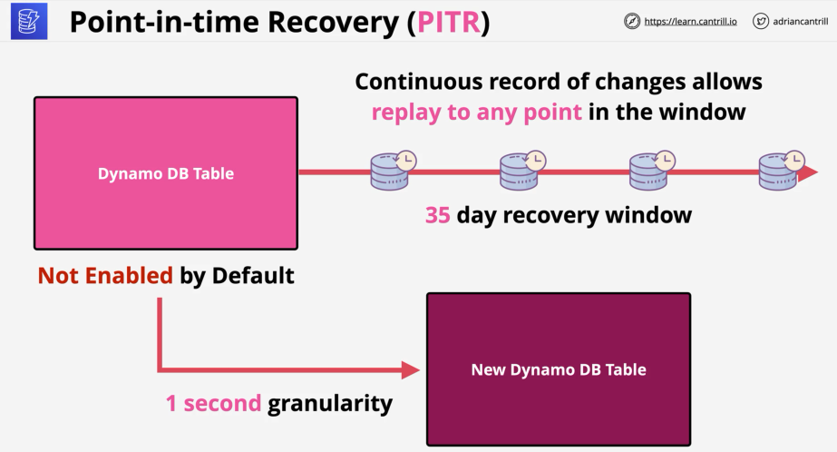

## DynamoDB Considerations

- It is a NoSQL database, it is NOT relational, not suited for relational data
- It is a Key/Value database
- Access to DynamoDB tables is via console, CLI, or API (SDK) => not SQL
- True SQL query language is not supported, DynamoDB offers support for PartiQL (SQL like language)
- Billing: based on RCU/WCU, storage and additional features enabled. Reserved allocation can be purchased for longer commitments

## DynamoDB Operation, Consistency and Performance

- We can chose between two different capacity modes at table creation: **on-demand** and **provisioned**
- We may be able to switch between those capacity modes afterwards
- On-demand capacity mode:
  - Designed for unknown, unpredictable load
  - Low admin
  - We don't have to explicitly set capacity settings, all handled by DynamoDB
  - Paying price per million R or W unit (more expensive than provisioned)
- Provisioned capacity mode:
  - We set the RCU/WCU per table
- **Every operation on a DynamoDB table consumes at least 1RCU or WCU**
- 1 RCU is `1 * 4KB` read operation per second for strongly consistent reads, `2 * 4KB` read operations per second for eventual consistent reads
- 1 WCU is `1 * 1KB` write operation per second
- Every table has a RCU and WCU burst pool (equals to 300 seconds of RCU/WCUs set on the table)
- If depleting the stock => ProvisionedThroughputExceeded exception error with any query
- DynamoDB operations:
  - **Query**:
    - When a query is performed we need to provide a partition key. Optionally we can provide a sort key or a range
    - Query item can return 0 or more items, but we have to specify the partition key every time
    - We can specify specific attributes we would want to be returned, but we will be charged for querying the whole item anyway

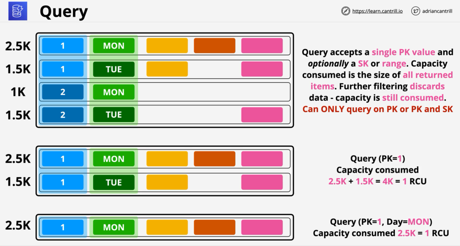

- **Scan**:
  - Least efficient operation, but the most flexible
  - Scan moves through a table consuming the capacity of every item
  - Any attribute can be used and any filters can be applied, but scan will consume the capacity for every item scanned through

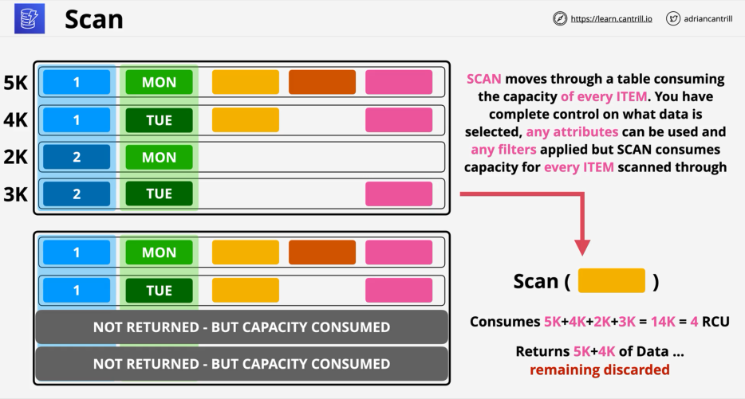

## DynamoDB Consistency Model

- DynamoDB can operate using two different consistency modes (what happens when you read data that has just been updated):
  - **Eventually consistent**
  - **Strongly (immediately) consistent**
- DynamoDB replicates data across multiple AZs using storage nodes. Storage nodes have a leader node, which is elected from the existing nodes. If it fails, another one is elected as leader.
- DynamoDB has a fleet of entities which redirect connections to the appropriate storage nodes. Writes are always directed to leader node
- The leader nodes replicates data to other nodes, typically finishing within a few milliseconds
- There are 2 types of reads possible in DynamoDB:
  - Eventually consistent reads:
    - It might happen that we attempt to read data which is outdated (stale) / not present at all
    - 50% of the cost vs \*_strongly consistent_ RCUs
  - Strongly consistent reads:
    - These read operations always use the **leader node**
    - Scales less well
    - Not every application can tolerate eventually consistent reads
    - Strongly consistent reads cost 2x more than eventually consistent ones

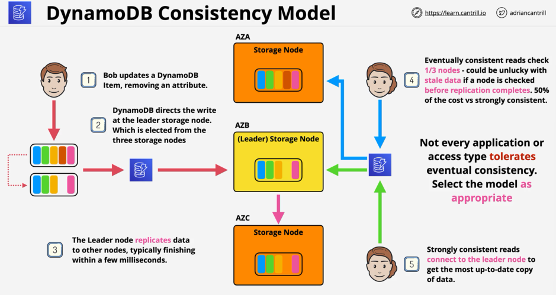

## WCU/RCU Calculation

- Example: we need to store 10 items per second, for ex with 2.5K average size per item
  - WCU required:
    ```
    ROUND UP(ITEM SIZE / 1 KB) => 3
    MULT by average (30) => WCU required = 30
    ```
- Example: we need to retrieve 10 items per second, for ex with 2.5K average size per item
  - RCU required:
    ```
    ROUND UP (ITEM SIZE / 4 KB) => 1
    MULT by average read ops per second (10)
    => Strongly consistent reads = 10
    => Eventually consistent reads = 10/2 = 5
    ```

## DynamoDB Indexes

- LSIs and GSIs
- Are ways to improve efficiency of data retrieval from DynamoDB
- Indexes are alternative views on table data, allowing the query operation to work in ways that it couldn't otherwise
- LSI => allow to create view with an alternative SK (but same PK)
- GSI => allow to create view with different PK and SK
- Some or all attributes (**projection**)

### Local Secondary Indexes (LSI)

- **Must be created with the base table (not after creation)!**
- We can have at max 5 LSIs per base table
- LSIs allow an alternative sort key, but **with the same partition key**
- They share the same RCU and WCU with the main table
- Possible to use **eventually and strongly consistent** reads
- Attributes which can be projected into LSIs: `ALL`, `KEYS_ONLY`, `INCLUDE` (we can specifically pick which attribute to be included)
- Local Secondary Indexes are sparse: only items which have a value in the index alternative SK are added to the index

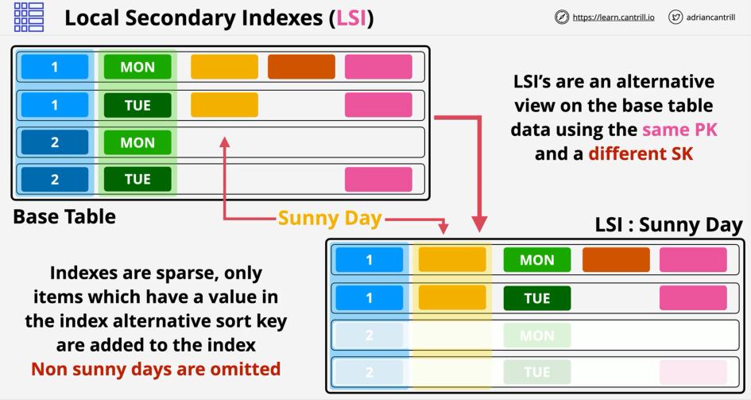

### Global Secondary Indexes (GSI)

- Can be created at any time
- Default limit of 20 GSIs per base table
- We can define different PK and a different SK
- GSIs have their own RCU and WCU allocations if we are using provisioned capacity
- Attributes which can be projected into an index: `ALL`, `KEYS_ONLY`, `INCLUDE` specific attributes
- GSIs are also sparse, only items which have values in the new PK and optional SK are added to the index
- GSIs are always **eventually consistent**, since the data is replicated asynchronously from the main table

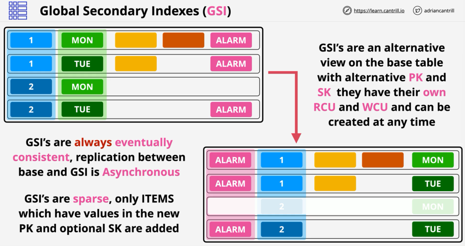

### LSI and GSI Considerations

- We have to be careful with the projections, more capacity is consumed if we project unnecessary attributes
- If we don't project a specific attribute and require that when querying the index, it will fetch the data from the main table, the query becoming inefficient
- AWS recommends using GSIs as default, LSI only when strong consistency is required

## DynamoDB Streams and Triggers

- A DynamoDB stream is a time ordered list of item changes in a DynamoDB table
- A DynamoDB stream is a 24h rolling window of these changes. Behind the scenes => uses Kinesis Streams
- Streams has to be enabled on a per table basis
- Streams record inserts, updates and deletes
- We can create different view types influencing what is in the stream
- Available view types:
  - `KEYS_ONLY`: the stream will only record the partition key and available sort keys for items which did change
  - `NEW_IMAGE`: stores the entire item with the new state after the change
  - `OLD_IMAGE`: stores the entire state of the item before the change
  - `NEW_AND_OLD_IMAGE`: stores the before/after states of the items in case of a change
- In some cases the new/old states recorded can be empty, example in case of a deletion the new state of an item is blank

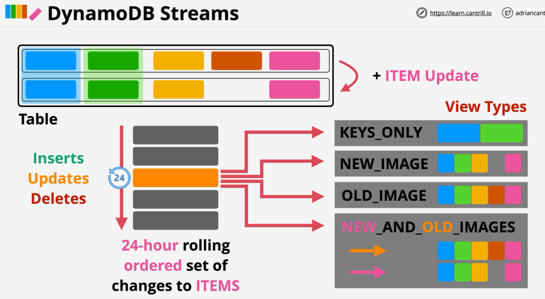

- Streams are the foundation for database triggers
- An item change inside a table generate an event, which contains the data which changed
- An action is taken using that data in case of event
- We can use streams and Lambda in case of changes and events
- Streams and triggers are useful for data aggregation, messaging, notifications, etc, without having to continuously poll a database.

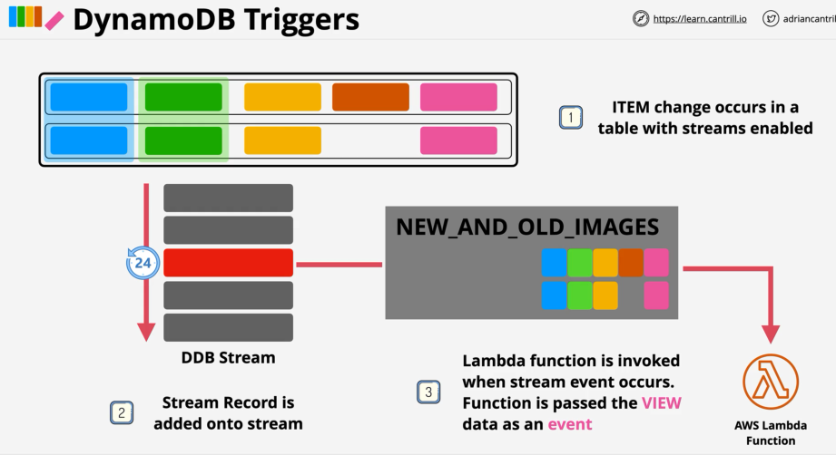

## DynamoDB Accelerator (DAX)

- It is an in-memory cache directly integrated within DynamoDB
- DAX can be used by using the DAX SDK from the application => DAX returns the data from its cache or by retrieving it from the DB (and then caching it).

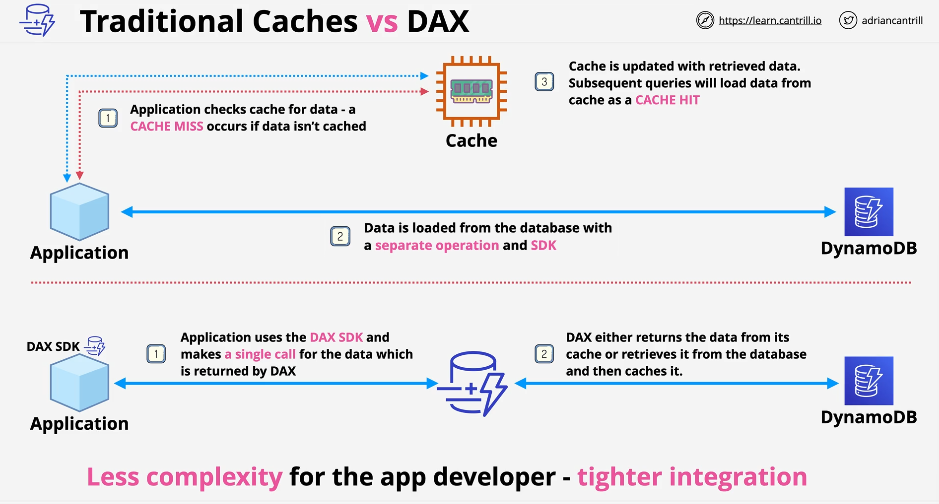

- DAX **is not a public AWS service** => it operates within a VPC, designed to be deployed in multiple AZs in a VPC
- DAX is a cluster service, nodes are placed in different AZs. There a primary nodes from which data is replicated into replica nodes
- DAX maintains 2 different caches:
  - Items cache: holds results of (`Batch`)`GetItem` calls
  - Query cache: holds the collection of items based on query/scan parameters
- DAX is accessed via an endpoint. This endpoint load balances across nodes
- Nodes are HA, if primary node fails another node is elected
- DAX can scale UP or scale OUT
- When writing data to DynamoDB, DAX uses write-through caching, the data is written at the same time to the cache as it is written to the DB
- DAX is deployed in a VPC! Any application which wants to use DAX has to be in a VPC as well
- Cache hits are returned in microseconds, cache misses in milliseconds
- DAX is an in-memory cache => much faster reads + reduced costs
- DAX is **NOT** suitable for applications **requiring strongly consistent reads**

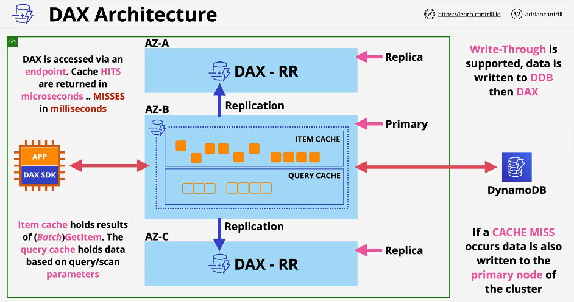

## DynamoDB Global Tables

- Global tables provide multi-master cross-region replication
- To implement global tables we have to create tables in multiple regions and add them to the same global table (becoming replicate tables)
- DynamoDB utilizes **last writer wins** in conflict resolution
- We can read and write to any region, updates are replicated generally sub-second
- Strongly consistent reads are only supported in the same region as writes
- Global tables provide global HA and global DR/BC (Disaster Recovery / Business Continuity)

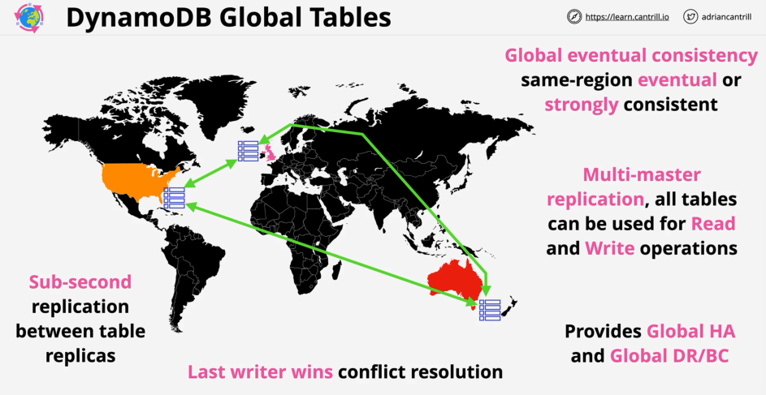

## DynamoDB TTL

- TTL = Time-to-Live => timestamp for auto-deletion of items
- In order to use TTL we have to enable it on a table and select a specific attribute for the TTL
- The attribute should contain a number representing an epoch (number of seconds)

1. A per-partition process periodically runs for checking the current time to the value in the TTL attribute. => Items where the TTL attribute is older than the current time are set to expired
2. Another per-partition background process scans for expired items and removes them from tables and indexes, adding a delete event to the streams is enabled

- These processes run on the background without affecting the performance of the table and without any additional charge
- We can configure a dedicated stream linked to the TTL processes, having 24h rolling window for any deletions caused by the TTL processes. Useful if we want to have any housekeeping where we track the TTL events that occur on tables (for example we can implement an un-delete process)

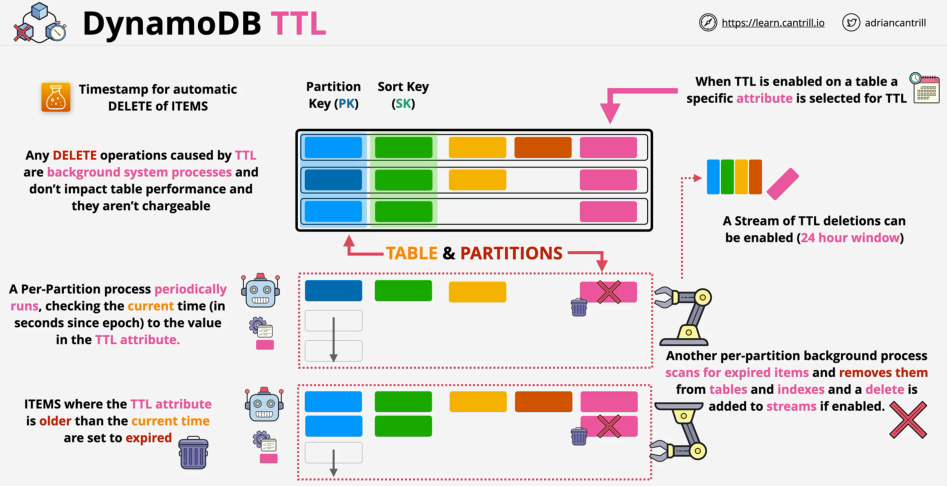
