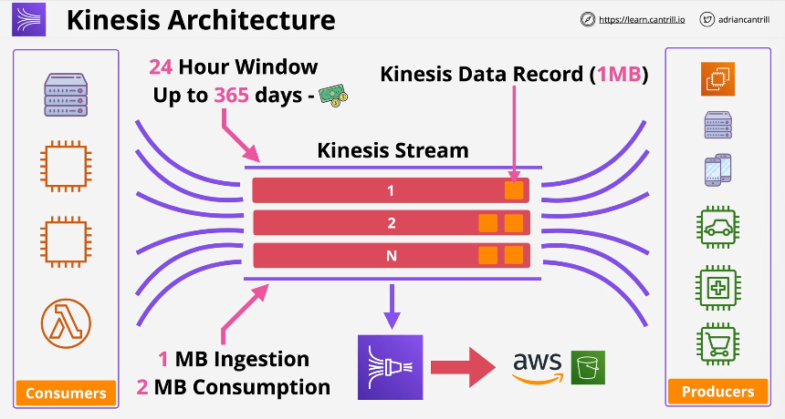
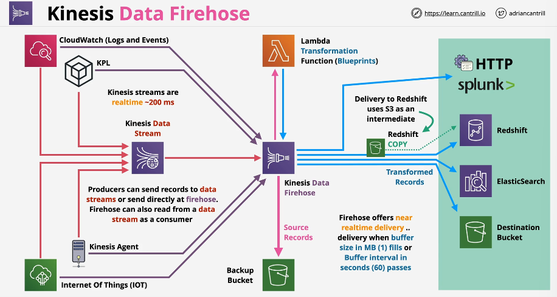
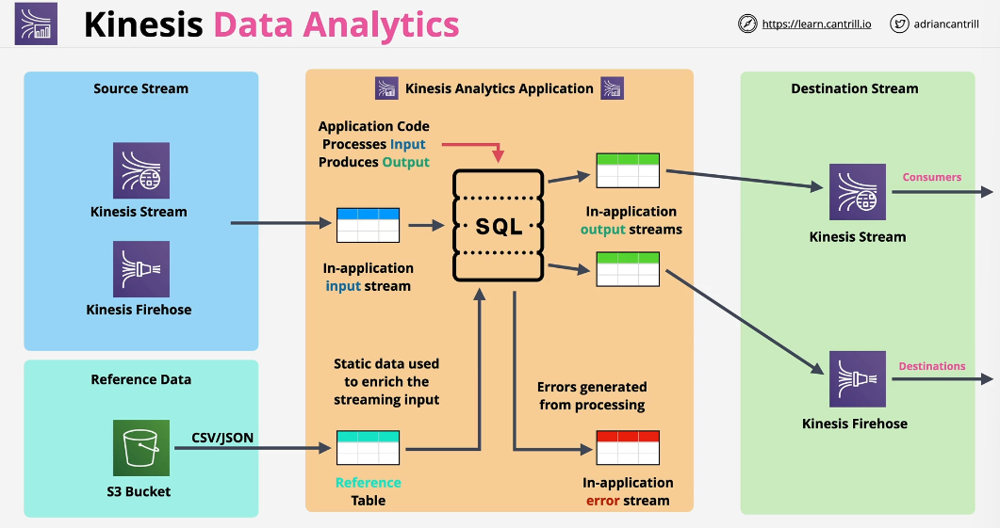
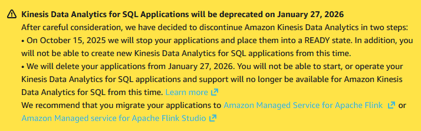

# Kinesis

- Is a scalable streaming service, designed to ingest lots of data
- Producers send data into a Kinesis stream (stream = basic entity of Kinesis)
- Streams can scale from low to near infinite data rates
- It is a public service and it is HA in a region by design
- Persistence: streams store by default a 24H moving window of data
- Kinesis include storage to be able to ingest and retain it for 24H by default (can be increased to 365 days **at additional cost**)
- Multiple producers/consumers can publish/consume the data (and anytime from the moving window)

## Kinesis Data Streams

- Kineses Data Streams are using shards architecture for scaling, initially there is one shard, additional shards can be added over time to increase performance
- Streams are realtime (~200ms)
- Each shard provides its own capacity, each shard has 1MB/s ingestion capacity, 2MB/s consumption capacity
- Shards directly affect the price of the Kinesis stream, we have to pay for each shard
- Pricing is also affected by the length of the storage window. By default, it is 24H => can be increased up to 365 days
- Data is stored in Kinesis Data Records (1MB), these records are distributed across shards
- Capacity: on-demand VS provisioned (defined number of shards)

## SQS vs Kinesis Data Streams

- Is it about ingestion of data (Kinesis) or about decoupling, worker pools (SQS)
- SQS usually has 1 production group, 1 consumption group
- SQS is designed for decoupling and asynchronous communication
- SQS does not have the concept of persistence, no time window for persistence
- Kinesis is designed for huge scale ingestion, having multiple consumers with different rates of consumption
- Kinesis is recommended for ingestion, analytics, monitoring, click streams

## Kinesis Data Firehose

- Used to provide data ingestion for other AWS services such as S3
- Fully managed service used to load data for data lakes, data stores and analytics services
- Data Firehose scales automatically, it is serverless and resilient
- **Near real time** product (~60 seconds for delivery => **NOT** real time)
- Supports transformation of data on the fly using Lambda. This transformation can add latency
- Firehose is a pay as you go service, we pay per volume of data that goes through Firehose
- Firehose supported destinations:
  - HTTP endpoints (third party providers)
  - Splunk (has direct support for it)
  - RedShift
  - OpenSearch (ElasticSearch)
  - S3
- Firehose can accept data directly from producers (if no need for Data Streams features => bypass) or from Kinesis Data Streams
- Firehose receives the data in real-time, but the ingestion is buffered
- Firehose's buffer by default waits for 1MB of data in 60 seconds before delivering to consumer. For higher load, it will deliver every time there is an 1MB chunk of data
- Data is sent directly form Firehose to destination, exception being Redshift, where data is stored in an intermediary S3 bucket
- Firehose use cases:
  - Persistence for data coming into Kinesis Data Streams
  - Storing data in a different format (ETL)

## Kinesis Data Analytics

Deprecated for **Amazon Managed Service for Apache Flink**

- It is a real-time data processing product using SQL
- The product ingests data from Kinesis Data Streams or Firehose
- After the data is processed, it can be sent directly to destinations such as:
  - Firehose (data becoming near-real time)
  - Kinesis Data Streams
  - AWS Lambda
- Kinesis Data Analytics architecture:

- Kinesis Data Analytics use cases:
  - Anything using stream data which needs real-time SQL processing
  - Time-series analytics: election data, e-sports
  - Real-time dashboards: leader boards for games
  - Real-time metrics

