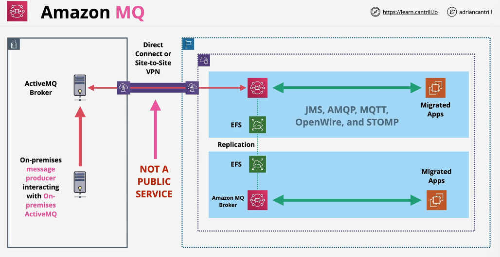

# Amazon MQ

- SNS and SQS are AWS services using AWS APIs
- SNS provides topics which are one to many communication channels, SQS provides queues which are one to one communication channels
- Both SNS and SQS are public services, HA and AWS integrated
- Larger organization might already use on-premise messaging systems, which are not entirely compatible with SNS and SQS
- Amazon MQ:
  - Open-source message broker: managed implementation of Apache ActiveMQ
  - It supports the JMS API and protocols such as AMQP, MQTT, OpenWire and STOMP
  - It provides **both queues and topics**
  - It uses message broker services which can be single instance (test, dev) and HA pair (Active/StandBy for production)
  - Unlike SQS and SNS, Amazon MQ is not a public service, it runs in a VPC
  - It does not have native integration with other AWS services in the same way as SNS/SQS
  - One-to-One or One-to-Many
  - Not a public service => deployed in a VPC
- Amazon MQ considerations:

  - By default we should chose SNS/SQS for newer implementations
  - We should use Amazon MQ if we migrate from an existing system with little to no application change
  - We should use Amazon MQ if we need APIs such as JMS or protocols such as AMQP, MQTT, OpenWire, STOMP
  - Amazon MQ requires the appropriate private networking

- Example of co-existing on-prem and AWS MQ implementation (during migration) => private connectivity to on-prem is required:

