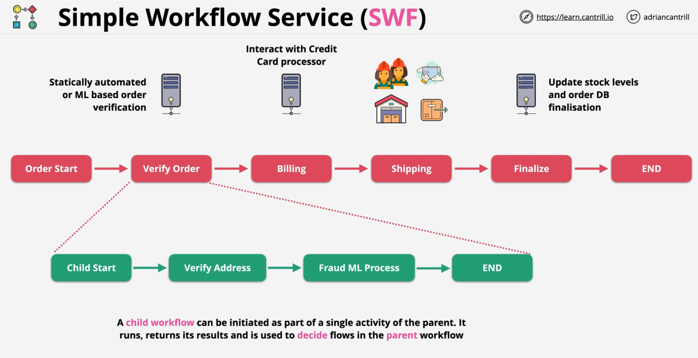

# SWF - Simple Workflow Service

**Legacy product, not serverless - AWS recommends using AWS Step Functions (serverless) instead. Use only SWF if a specific workflow requires it.**

- Allows us to build workflows used to coordinate activities over distributed components (example: order flow)
- Allows to build complex, automated and human involved workflows
- It is the predecessor of Step Functions, it uses instances/servers
- It has the same patterns/anti patterns as Step Functions and can be used for long running workflows
- Workflow: set of activities that carry out some objective together with the logic that coordinates the activities
- Within workflows we have activity task and activity workers
- A worker is program that we create to perform tasks
- Workflows have deciders, applications that run on an unit of compute of AWS
- Deciders schedule activity tasks, provides input data to activity workers, processes events and ends the workflow when the object is completed
- SWF workflows can run for max 1 year

## SWF vs Step Functions

- Default: Step Functions - they are serverless, they require lower admin overhead
- AWS FLow Framework - way of defining workflows supported by SWF
- External Signals to intervene in process, we need SWF
- Launch child flows and have the processing return to parent, we need to use SWF
- Bespoke/complex decision logic: use SWF (custom decider application can be coded by us, we can implement whatever logic we want)
- **Mechanical Turk** integration: use SWF (suggested AWS architecture)
