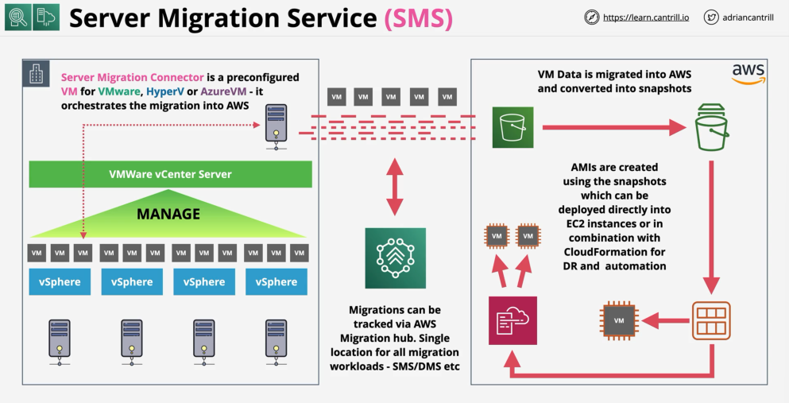

# VM Migrations Between AWS <=> On-Premises

## Application Discovery Service (ADS)

Now replaced with AWS Transform !

- Allows us to discover on-premises infrastructure:
  - What VMs we have
  - What CPU and memory are allocated to them
  - MAC addresses
  - Resource utilization
  - etc.
- It also tracks these properties over time for more effective migration
- ADS runs in 2 modes:
  - Agentless (Application Discovery Agentless Connector):
    - It is an OVA based virtual appliance that integrates with VMWare
    - It can measure performance and resource usage, information which can be obtained from the outside of a VM
  - Agent Based mode (with CloudWatch Agent): offers additional information from inside of a VM
    - Offers data gathering for network, processes, performance
    - We can see applications running on a VM
    - We can even see dependencies between VM based on network activity
- ADS does not migrate anything, it helps us discover VM instances and relationships between them in order to be migrated
- This information is valuable if we have thousands of instances we want to migrate
- ADS integrates with AWS Migration Hub (now replaced by **AWS Transform**) and Athena
- **AWS Transform**: tracks migrations of different types in AWS. Migrations such as VM migrations and database migrations

## Server Migration Service (SMS)

- Used to migrate whole VMs into AWS (including OS, Data, Apps, etc.)
- This is the tool which actually **performs** the migration
- It runs in **agentless** mode using a connector. The connector is VM which runs on on-premises within our existing VM environment
- The connector only integrates with VMware, Hyper-V and AzureVM
- SMS does incremental replication of live volumes => can migrate a VM in the background while it is still operating
- Offers orchestration of multi-servers migrations
- Creates AMIs which can be used to create EC2 instances
- It can be used with other tooling such as CloudFormation to automate repeated deployment of instances
- It also integrates with **AWS Transform**

## AWS Application Migration Service (MGN)

- Is used to migrate servers from on-prem to AWS
- It allows companies to lift-and-shift a large number of physical, virtual, or cloud servers without compatibility issues, performance disruption, or long cutover windows
- AWS recommends agent-based replication when possible as it supports continuous data protection (CDP)
- AWS MGN provides this agent. MGN creates a Launch Template which is then used to launch EC2 instances
- AWS MGN provides a way to work out what kind of dependencies do we have between databases, app servers, web servers, etc. We can group these servers and migrate them together
- It can also provide CloudFormation templates for deployment
- Difference between SMS and MGN:
  - Server Migration Service utilizes incremental, snapshot-based replication and enables cutover windows in hours
  - Application Migration Service utilizes continuous, block-level replication and enables short cutover windows measured in minutes
- AWS recommends to use MGN instead of SMS
- We can migrate virtual and physical servers as well
